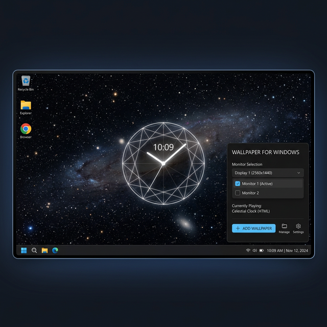

<div align="center">

# 🖥️ Wallpaper for Windows
**"High-Performance HTML5 Live Desktop Engine"**

[](https://github.com/Santaslileper/wallpaper-for-windows)
[](https://github.com/Santaslileper/wallpaper-for-windows)
[](https://github.com/Santaslileper/wallpaper-for-windows)
[](md/LICENSE.md)

[Download Release](https://github.com/Santaslileper/wallpaper-for-windows/releases/latest) • [Source Code](src/) • [Bundled Themes](assets/wallpapers/) • [Report Bug](../../issues)

---



Wallpaper for Windows is a system-integrated live wallpaper engine that enables the rendering of standard HTML5/JS/WebGL content directly on the desktop. By utilizing a hybrid C# and Rust architecture, it provides an efficient gateway for interactive and animated backgrounds with minimal resource consumption.

---

</div>

### 🛠️ Technical Specifications
| **Component** | **Implementation Details** | **Notes** |
| :--- | :--- | :--- |
| **Control Shell** | .NET Framework 4.0 (`WallpaperManager.exe`) | Win32 Handle & UI Management |
| **Renderer Engine** | Rust-based Chromium Embedded (`wall-renderer.exe`) | High-concurrency WebGL support |
| **Display Injection** | Win32 `SetParent` / `Progman` hooks | Direct Desktop Plane rendering |
| **Optimization** | Background Fullscreen Polling | GPU-suspend during high-load |
| **Configuration** | Local JSON Persistence | 100% Offline |

---

### ✨ Core Features
*   🎨 **HTML5 Native Support**: Render any local or remote `.html` file as your active desktop background.
*   🖥️ **Multi-Monitor Logic**: Independent wallpaper assignment and scaling for complex workstation setups.
*   ⚡ **Low-Latency Rendering**: Embedded Rust engine ensures smooth 60Hz+ animations for physics-based themes.
*   🔄 **State Persistence**: Automated restoration of wallpaper history and monitor mapping on system boot.
*   🕹️ **Game Mode Protocol**: Real-time monitoring of foreground windows to suspend rendering during fullscreen applications.

---

### 📂 Pre-Loaded Templates
| **Template** | **Visual Characteristics** | **Resource Load** |
| :--- | :--- | :--- |
| **`default.html`** | Animated Gradient & Particle System | Low |
| **`temporal-flux.html`** | Cyberpunk HUD with 3D Object Rotation | Medium |
| **`memento.html`** | Minimalist Text Transformation | Minimal |

---

### ⚡ Build & Deployment
Build the management shell using the native Windows C# compiler:

```powershell
# 1. Compile the Manager Shell
& "C:\Windows\Microsoft.NET\Framework64\v4.0.30319\csc.exe" /target:winexe /win32icon:assets/icon.ico /out:"WallpaperManager.exe" "src/WallpaperManager.cs"

# 2. Execute Primary Binary
.\WallpaperManager.exe
```

---

### ⚠️ Privacy & Operational Notes
> [!IMPORTANT]
> **Network Integrity**: The core engine operates offline. External connections depend entirely on individual wallpaper payloads (e.g., CDN fonts or external API calls defined in your custom HTML).

> [!TIP]
> **Customization**: To add a new wallpaper, simply drop your HTML directory into `assets/wallpapers/`. The manager will automatically detect and list the new entry in the selection panel.

---

### ⚖️ License
Released under **Proprietary (Structured Freedom)** specifications. 
See [md/LICENSE.md](md/LICENSE.md) for full terms and usage permissions.

<div align="center">
  
[Santaslileper](https://github.com/Santaslileper)

</div>
